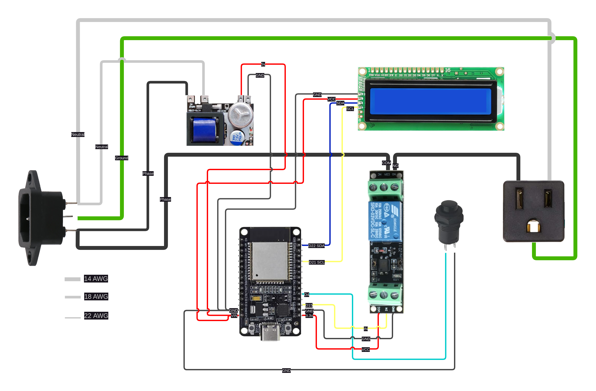
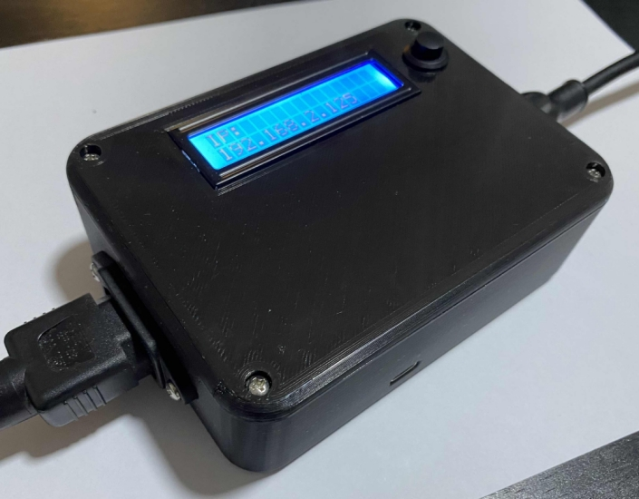
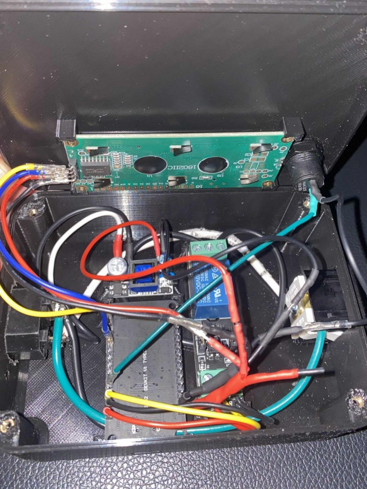

# CPLUG

This project is a smart plug powered by an ESP32 microcontroller, which controls a relay to switch connected devices on or off. The relay can be controlled through a simple and intuitive web interface, using API calls over the network. The device also displays relevant information on an I2C LCD screen and includes a physical button for direct control of the relay, ensuring usability even without network access.

### Assembled Device

  
  

## Features

1. **Wi-Fi Modes**:
   - Connects to an existing Wi-Fi network using stored credentials.
   - Creates an Access Point (AP) if no network credentials are available.

2. **Dynamic LCD Display**:
   - Displays the AP SSID and password when in AP mode without clients.
   - Shows the URL for relay control when a client connects to the AP or when connected to Wi-Fi.

3. **Physical Button Control**:
   - Allows direct control of the relay.
   - Button press takes priority over API or web-based control.

4. **Web Interface**:
   - Responsive relay control using modern AJAX (XHR).
   - Displays the current relay state without page refreshes.

5. **Non-Volatile Storage**:
   - Saves Wi-Fi credentials using the ESP32's Preferences library.

6. **Custom 3D-Printed Case**:
   - A 3D-printable STL file for the case is included in the `assets` folder.

## Requirements

### Software
- Arduino IDE or Arduino CLI
- ESP32 Board Support Package
- Required Libraries:
  - `WiFi.h`
  - `WebServer.h`
  - `Preferences.h`
  - `esp_wifi.h`
  - `LiquidCrystal_I2C.h`

### Hardware
- **ESP32 Microcontroller**
- **I2C LCD Display**: 16x2 with an I2C interface.
- **Relay Module**
- **Self-Lock Push Button**
- **Voltage Converter**: Converts 110V-240V AC to 5V DC for the ESP32.
- **NEMA 5-15R Socket**: A standard US receptacle for the relay-controlled device.
- **IEC 320 C14 Socket (AS-05, AC 250 V, 10 A)**: Common power inlet for devices.

**Note**: See the [Hardware](#hardware) section below for links to the components used.

## Installation

1. Clone this repository or copy the source code to your local machine.
2. Open the project in Arduino IDE or place it in a suitable directory for the Arduino CLI.
3. Install the required libraries:
   - Use the Arduino Library Manager or Arduino CLI.
   - Ensure the ESP32 board package is installed.
4. Connect your ESP32 and upload the code.

## Usage

1. **Initial Configuration**:
   - When powered on for the first time, the ESP32 will start in AP mode. The LCD will display the SSID and password for the AP.
   - Connect to the AP, and a captive portal will automatically open, guiding you to the network configuration page.
   - Navigate through the captive portal to configure Wi-Fi credentials.

2. **Relay Control**:
   - Access the web interface at the URL displayed on the LCD to toggle the relay state.
   - Press the physical button to control the relay directly. The button press overrides web control.

3. **LCD Display**:
   - Shows the current mode and necessary connection details:
     - AP mode without clients: SSID and password.
     - AP mode with clients: URL for relay control.
     - Wi-Fi connected: URL for relay control.

## Hardware

| Component                     | Description                                     | Link                     |
|-------------------------------|-------------------------------------------------|--------------------------|
| ESP32 Microcontroller         | The heart of the project.                      | [Link](https://www.amazon.com/DORHEA-Development-Bluetooth-ESP-WROOM-32-ESP32-DevKitC-32/dp/B0B18JQF16/ref=sr_1_4?crid=25G7VGNAWT774&dib=eyJ2IjoiMSJ9.aR60pLT4ci7QASJykSqRfgGDG_jUr8SiNvrNmjAwDhDlvNy0StOQUgZXOfjYzId7mAdCB_HcCIMW05vQNfdyvUsbEBINIsiMudzG0CskZdi4rJSzAG7vivwW1w1u0zIILp9qtYudKr-yfV62xQc7B36pVaGWQckNOdX2xZdajdN8TSqnIwYr5pD6b5dRtL5Jnndt4iDOWy_oneP7mcrX-r2XoSbTcFxIw1wvP1exjfk.WI5xbtAzXLtw3q7DZOykH-29DSS3rbJIN8vR7MnfGZs&dib_tag=se&keywords=esp32%2Btype%2Bc&qid=1731796381&sprefix=esp32%2Btype%2Bc%2Caps%2C92&sr=8-4&th=1)               |
| I2C LCD Display (16x2)        | Displays connection details and status.        | [Link](https://www.amazon.com/Freenove-Display-Compatible-Arduino-Raspberry/dp/B0B76Z83Y4/ref=sr_1_8?crid=22722MO4DGRTJ&dib=eyJ2IjoiMSJ9.FgsyN-p9btDlxidPTK0VokPyhYbPLtrx6CIymEFmeu8HquPf1mye9_E3q4YqeJaCkussmozj30rz006pS-j-Zxs4xNDP58nwopVfpcqb5vmIXURN5D7p3oDzlXHki8dlP-cNjHTlMKlta6xKRd9v_0Njw1XWCWGWeQhFLQtSgclvgg-do2hPTlyNWCtahsDMEHyzilTH4SX9fIQR_nQql1cxyts22M1cXowWT20wPd4.-sOvicqK9vaTRdz1Plc3fm6ynNQ2crNDuc7zpBJGeSI&dib_tag=se&keywords=I2C%2BLCD%2BDisplay&qid=1731796307&sprefix=i2c%2Blcd%2Bdisplay%2Caps%2C95&sr=8-8&th=1)               |
| Relay Module                  | Controls the electrical load.                  | [Link](https://www.amazon.com/Channel-Optocoupler-Isolated-Control-Arduino/dp/B07XGZSYJV/ref=sr_1_1?crid=PB1JA4J1TX9N&dib=eyJ2IjoiMSJ9.aQ-rgB_Q-5VmyzSnoas2VhAkGjDhkILgD44Dnr2wRspw5Qp-LtaFXKKteFBa6X0ESbHH3MFNPzqsRRI1MOM1pVOcQiMHu4wNWgSGydyyO5NViYg3PHuXdIyPeQO-Xdltw8nPeWVZu8tJ9F3oZQ0nuQKFwaEkmtkYS0zkeis_vLL8fPbUh_z2U8_lRga2iK3UqjJLn6YKg0ZaioaMUuxjz0blPndgwRlDTCBhTjAGsyA.LGNlUcpLCycIGoVbeYfQDlwwR6OLPRAMTPuAvHs4J60&dib_tag=se&keywords=3.3+relay&qid=1731796264&sprefix=3.3+relay%2Caps%2C83&sr=8-1)               |
| Self-Lock Push Button         | Physical control of the relay.                 | [Link](https://www.amazon.com/Cylewet-Self-Locking-Latching-Button-CYT1091/dp/B075VBV4QH/ref=sr_1_8?crid=2KIK6ERG6BN0P&dib=eyJ2IjoiMSJ9.Q0Cky4G0VZEtxUhetpGEcxkMA4g-0cejM6OzH7_EqwUG9l5s5uOP1NEe5xEu8aJlvH95Yr8B_k_6FD0LmWNwg297Td6C2Q40oG79wqW1Mavb5yGUdd6I5zddKtIvo89kQhaZNkyTd7MNJApQMUDWBUe8McBYsr18a85pK4X5KR-wpG2o6DsRET8pg1xFFyVLgSGe1A-SvmKNQ_pOElTnC_GC8kSqcHhYo9mFrb67JTE.0K4n9P1OeurHzMgPb1lFyRd3By2fWrSc6MVZ3T9eJJo&dib_tag=se&keywords=Self-Lock+Push+Button&qid=1731796223&sprefix=self-lock+push+button%2Caps%2C91&sr=8-8)               |
| Voltage Converter (110V-240V to 5V) | Powers the ESP32 from AC mains.               | [Link](https://www.amazon.com/Converter-Universal-Isolated-Switching-Version/dp/B07YXN8J6R/ref=sr_1_1?crid=3UPM554FWAPQ8&dib=eyJ2IjoiMSJ9.zdqFicpFqyz1Z1tKWYnlpaLNMNrL8BoeqXUJ9g36tAzf7-meuGKPv8ctHFgPLYjgOYwsBWNwN3GqHpw6QOvg71q2i0jv1dObiiWN8LbpopJY6PtrnOiq0knwtIwI-0cHBaqu2N2BawjL0qkS1LwS2MJjvldHY9Mg5hg3434L-A1usjyi52DSxShrEv_PcLvCWp9L1CMRB3rPMPzA7B3d2Jn77lkj-A-EeUfR-7l4ozw.UM5AheMT8vLujvvUIKo2IlyK4jw8GPB3GHP7dHmLKUI&dib_tag=se&keywords=110v%2Bto%2B5v%2Bconverter&qid=1731796176&sprefix=110v%2Bto%2B5v%2Bconverter%2Caps%2C83&sr=8-1&th=1)           |
| NEMA 5-15R Socket             | Standard US receptacle for connected devices.  | [Link](https://www.amazon.com/Leviton-1374-1-Receptacle-Straight-Grounding/dp/B0036ZA94S/ref=sr_1_1?crid=UHHV8AGXBC5B&dib=eyJ2IjoiMSJ9.M0yUuQhHRnbxlmw__q1OQsjqiKK7Lzq-amBfNVHlUW3exoDVYdswoF4ccXi6TsctIF8pWhs2Qt5tf9ZHR8Z3b-TRseGydRwAubybP-5LmzyA4aRBD0qzCH1_tI_36UB1UWPJrbrNoz-0z4Qh6lH24Ce0I3_k8kpyx9AwWENTZDqyTovK3UAqsOv-Pujo6GcT32IMqSibLjM9dkEyyaP4l4SMC7syEMpwJ5QJnx4_aUpSXjkJQjaKH2TC8sQSaJGlR4VdoFqvllPZVTFponQ8T_omKow75SovG-NTfQMWdIE.1HBg6GjAmhffm_9SL_MLdXJNd9bSK1kwkIMoonTajvM&dib_tag=se&keywords=Leviton+1374-1&qid=1731796140&sprefix=leviton+1374-1%2Caps%2C85&sr=8-1)          |
| IEC 320 C14 Socket (AS-05)    | Power inlet for AC connections.                | [Link](https://www.amazon.com/Baomain-Panel-Power-Socket-Connector/dp/B00WFYS1HS/ref=sr_1_1?crid=2AH4T4U21RJY0&dib=eyJ2IjoiMSJ9.o2AdHKFsyHimIjMr6q8nZA8UOt_GoRbGCrPzT085l6LmGa75eYUp2Iu93e91JlG-ZjGe-yor4HFuf1mvtRVtcm5KmduDByGhFHxt-kzASViMKf0OOzjHaLeEWpvepVyfPifnHwS5HujjkfdvMaR1ys0JTfGZoBOZZayyiODlNlgXQRUbeBY8whl7jbCTqxhqqfOeOG1r7tnm2FsTqq1ykwNWGQkgUMIFuup9lu8L_98.qGuYcbvfJGRp2hODLt11jA4VYX2CxGktAQs5OteeDsE&dib_tag=se&keywords=IEC%2B320%2BC14%2BAS-05%2BAC%2B250%2BV%2B10%2BA&qid=1731795545&sprefix=iec%2B320%2Bc14%2Bas-05%2Bac%2B250%2Bv%2B10%2Ba%2Caps%2C54&sr=8-1&th=1)             |
| M3 Inserts    | M3 insert for lid locking.                | [Link](https://www.amazon.com/cSeao-120pcs-Inserted-Knurled-Embedded/dp/B07D683Q26/ref=sr_1_11?crid=N839MT9MEB0&dib=eyJ2IjoiMSJ9.BwFSXFaGs6U0QlD21q7anfRjKx8fcWIVVXDrKtU1Yo7g1lHY48A7-26837xuO4F2Ssg_Sx_ynNHAGdIvsNa2ThFNgQkNyX-LUT8ivDBEAd1eKuCpKPvQGEbBa7O8YMQSP-sqK79dW-2i68HhO7yJYukDzecnrYyhUKayA2AelA53HvCPMeghReTvODpibVUNhc8p1PKd9ht5c3eqeiXtetUtZ2ZAUWoDsGnleXf0IsY.E7LUj37njgflZGeeeHaksSZCL2Vs69lXinDTYqzEfZo&dib_tag=se&keywords=3mm+insert&qid=1731796825&sprefix=3mm+insert%2Caps%2C80&sr=8-11)             |
| M3 screws    | M3 screws.                | [Link](https://www.amazon.com/Taiss-Screws-Stainless-Assortment-Wrenches/dp/B0CS6FVH6G/ref=sr_1_8?crid=1H1JREBPXZQUU&dib=eyJ2IjoiMSJ9.ddCR5pjnGHbNJnXCOUJw9qTYo5zl7m08eLFdJc_fUtLRGMkxWxlrKIeJRBhaxZ-7rclPpb1MD236MeDwbb92bc4457UzaqqOPV6YFWt8ndilpIteXFTdQuuw4t4ZTmg5bL-p11dq7-HYxKo1yEmvMhUmdP8x4jqDqpTak4yG87hJNuASfoKwtGaksukNju9o2aWLTVBIhzuyhQ2MUTj1Gw78WoBxLgUfNBVZSBipvT4.FapOMKETEi3edFoJWFkEY2h6Zcm_MxtBZEvy5e0q5_o&dib_tag=se&keywords=3mm+screws&qid=1731796914&sprefix=3mm+screws%2Caps%2C86&sr=8-8)             |

## Custom Case

- A 3D-printable case designed for this project is available in the `assets` folder.
- The STL file can be printed with standard PLA or ABS material without support.

## Example Web Interface

- **Relay State**: Displays whether the relay is `ON` or `OFF`.
- **Toggle Button**: Instantly toggles the relay state.
- Uses modern AJAX (XHR) for a seamless user experience.

## Known Issues and Future Improvements

1. **Button Behavior**:
   - Relay state may not update on the web interface while the button is pressed. This behavior is by design to prioritize physical control.

2. **Suggestions**:
   - Add password protection to the web interface for enhanced security.
   - Include OTA (Over-the-Air) updates for easier firmware management.

## License

This project is licensed under the MIT License. See the [LICENSE](LICENSE) file for details.
